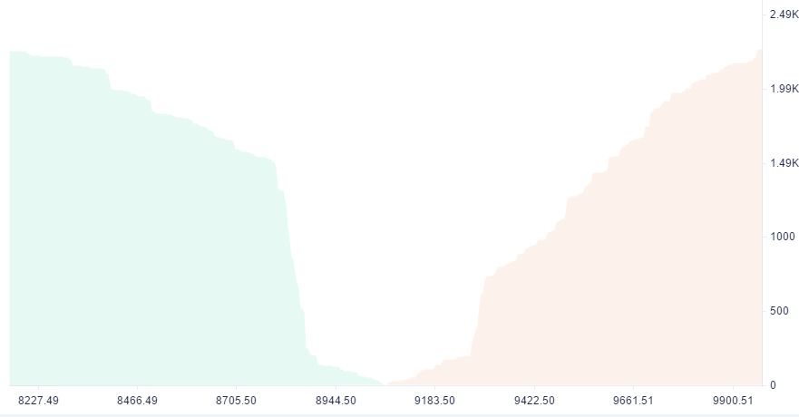

一、什么是深度图

深度图，直观描述了买卖双方交易意愿价格的分布图。只要买卖双方挂单价格有交集，则立即成交。对买方来说，只要卖单价小于等于买入价，则交易就可以成交。对卖方来说，只要买单价大于等于卖出价，也是可以立即成交的。

显然，最有可能成交的就是卖单最低价、买单最高价。所以对于卖出价更高，买入价更低的数据，立即成交的可能性低于前者，所以一般绘制深度图时，只取两者前部分挂单(比如前20个订单): 买入价最高的前20个订单、卖出价最低的前20个订单。

二、本文的目标：

1. 理解深度图的含义，能懂深度图。
2. 能使用HTML5 Canvas绘制深度图。
3. 提供最终的HTML5深度图源代码，希望能帮助到各位读者。



如上图，就为BTC在某个时间点的深度图，我们可以得知:

1. 横坐标为买入、卖出价格刻度。
2. 纵坐标为订单交易量总数。
3. 低于某个价格（买单）或高于某个价格（卖单）的交易量围成的区域，即为图示的区块部分。

三、实践
这些图也比较简单，通过使用HTML5 Canvas可以很容易绘出。为此我们需要先准备订单数据：

1. 准备数据
	卖入价最高前N个订单，卖出价最低的前N个订单，以及每个订单对应的交易量，先设定N为10。准备以下数据即可。

```javascript
var data = {
	"sell":
	[
	{"price":9000,"amount":8176},
	{"price":8999.84,"amount":10245},
	{"price":8999.68,"amount":19147},
	{"price":8999.52,"amount":4150},
	{"price":8999.36,"amount":10420},
	{"price":8999.2,"amount":16053},
	{"price":8999.04,"amount":8480},
	{"price":8998.88,"amount":12751},
	{"price":8998.72,"amount":14187},
	{"price":8998.56,"amount":7916}
],
"buy":[
	{"price":8749,"amount":8379},
	{"price":8748.74,"amount":18582},
	{"price":8748.48,"amount":9173},
	{"price":8748.22,"amount":13327},
	{"price":8747.96,"amount":1990},
	{"price":8747.7,"amount":3414},
	{"price":8747.44,"amount":12062},
	{"price":8747.18,"amount":19389},
	{"price":8746.92,"amount":8999},
	{"price":8746.66,"amount":8675}
]
};

```
表示了每个买、卖订单的价格和其交易量，注意：数据顺序从价格高到低排列。

<b>计算每个价格区间的交易总量</b>

针对买单，就是要计算“大于等于当前价格的累计总量”，同理，针对卖单，就是要计算“小于等于当前价格的累计总量”。

```javascript
for(i in $data['buy']){
		var total = 0;
		for(n=0; n<= i; n++){
				total += $data['buy'][n]['amount'];
		}
		
		$data['buy'][i]['total'] = total;
	}
	
for(i in $data['sell']){
		var total = 0;
		for(n=i; n< $data['sell'].length; n++){
				total += $data['sell'][n]['amount'];
		}
		
		$data['sell'][i]['total'] = total;
}
```

每个订单的total就是累计交易总量值。

<b>2.开始绘图</b>

HTML5 canvas左上角为0点，向右为X轴正方向，向下为Y轴正方向。先准备3块画布，图表区、价格刻度区，交易量刻度区。

最后，你可以结合ajax实现动态图表展示。

具体的代码，可以[查看最终效果](depth-chart.html)

